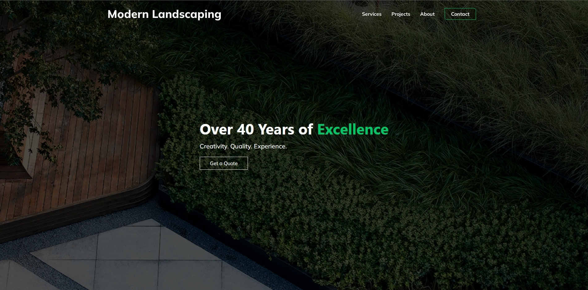
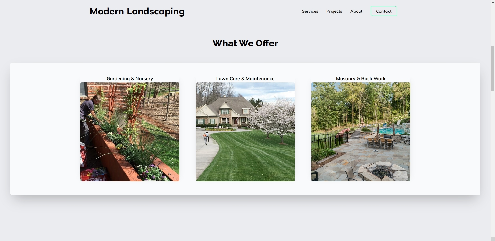
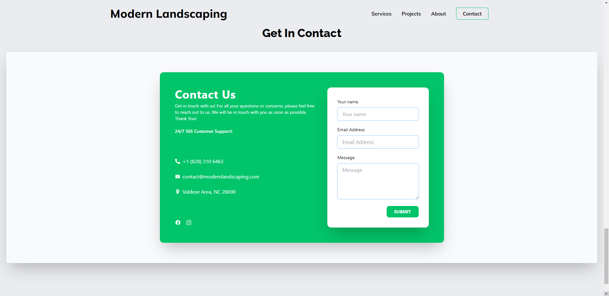

# Modern Landscaping LLC Website

You can view this project [here](https://lyrics-music-app.netlify.app).

## Built using:

Frontend:

- [Next.js](https://nextjs.org)
- [Tailwind CSS](https://tailwindcss.com)
- [CSS3](https://developer.mozilla.org/en-US/docs/Web/CSS)

Deployment:

- [Netlify](https://www.netlify.com)

## Setup

- run `npm i && npm start`

## Getting Started

In the project directory, you can run:

### `npm start`

Runs the app in the development mode.\
Open [http://localhost:3000](http://localhost:3000) to view it in your browser.

The page will reload when you make changes.\
You may also see any lint errors in the console.
